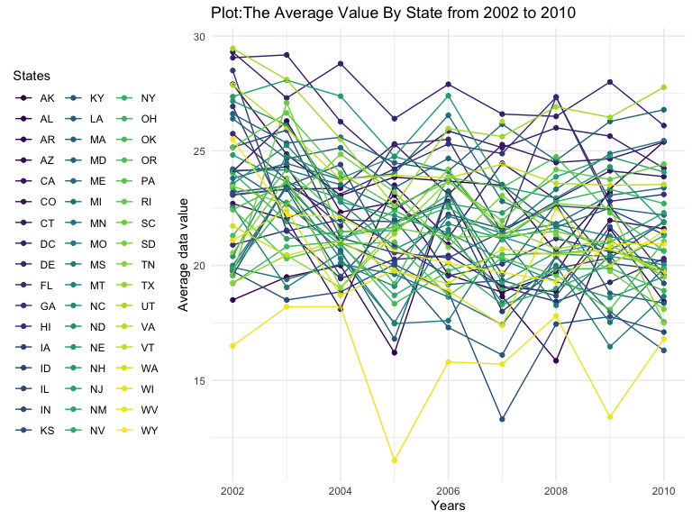
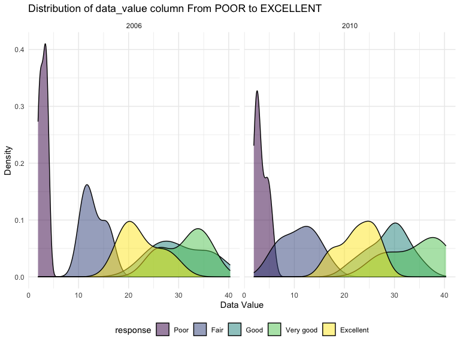
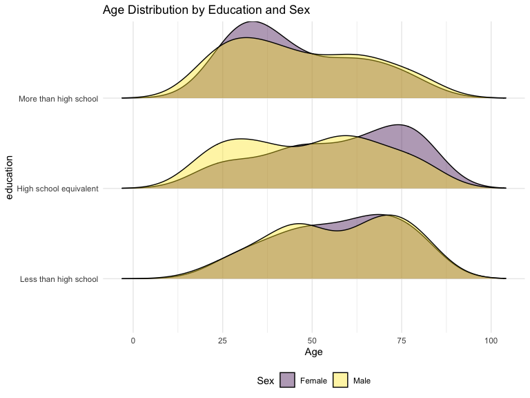
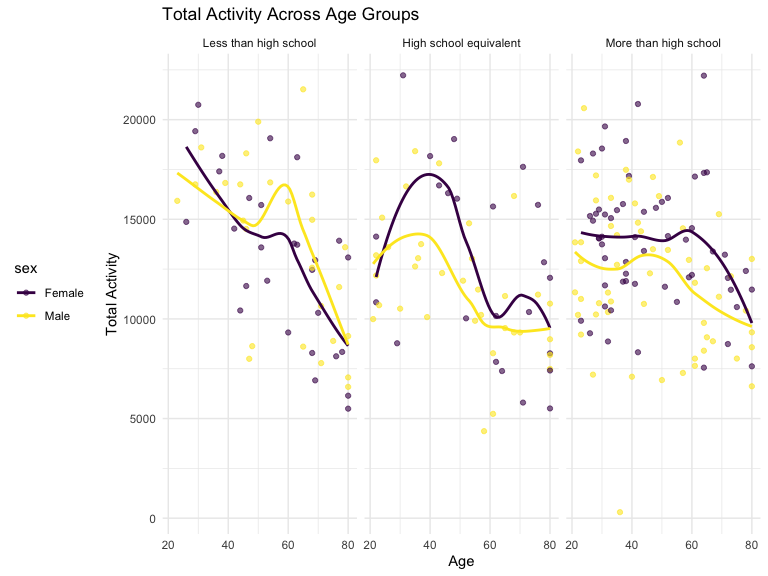
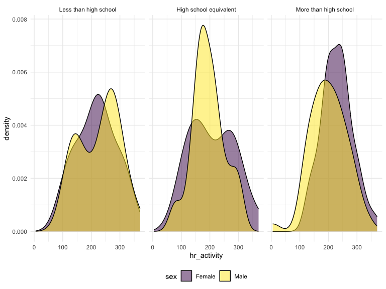

P8105_HW3_jao2195
================
Jennifer O.
2023-10-10

################################################################################ 

### Problem 0

################################################################################ 

This “problem” focuses on structure of your submission, especially the
use git and GitHub for reproducibility, R Projects to organize your
work, R Markdown to write reproducible reports, relative paths to load
data from local files, and reasonable naming structures for your files.

To that end:

-create a public GitHub repo + local R Project; we suggest naming this
repo / directory p8105_hw3_YOURUNI (e.g. -p8105_hw3_ajg2202 for Jeff),
but that’s not required -create a single .Rmd file named
p8105_hw3_YOURUNI.Rmd that renders to github_document -create a
subdirectory to store any local data files, and use relative paths to
access these data files -submit a link to your repo via Courseworks
-Your solutions to Problems 1, 2, and 3 should be implemented in your
.Rmd file, and your git commit history should reflect the process you
used to solve these Problems.

For this Problem, we will assess adherence to the instructions above
regarding repo structure, git commit history, and whether we are able to
knit your .Rmd to ensure that your work is reproducible. Adherence to
appropriate styling and clarity of code will be assessed in Problems 1+
using the style rubric.

This homework includes figures; the readability of your embedded plots
(e.g. font sizes, axis labels, titles) will be assessed in Problems 1+.

################################################################################ 

### Problem 1

################################################################################ 

This problem uses the Instacart data. DO NOT include this dataset in
your local data directory; instead, load the data from the
p8105.datasets using:

``` r
# Loading My Libraries
library(readxl)
library(ggplot2)
library(tidyverse)
library(readr)
library(lubridate)
library(magrittr)
library(dplyr)
library(ggridges)
library(patchwork)
library(p8105.datasets)
```

``` r
#Loading Instacart Data 
library(p8105.datasets)
data("instacart")
```

The goal is to do some exploration of this dataset. To that end, write a
short description of the dataset, noting the size and structure of the
data, describing some key variables, and giving illustrative examples of
observations. Then, do or answer the following (commenting on the
results of each):

How many aisles are there, and which aisles are the most items ordered
from? Make a plot that shows the number of items ordered in each aisle,
limiting this to aisles with more than 10000 items ordered. Arrange
aisles sensibly, and organize your plot so others can read it.

``` r
#Renaming main dataset
data("instacart")

instacart = 
  instacart |> 
  as_tibble()

#class(insta)
#Number of Aisles
# View(insta)
# num_aisles = nrow(unique(insta$aisle))
# num_aisles
```

#### Answer questions about the data

This dataset contains 1384617 rows and 15 columns, with each row
resprenting a single product from an instacart order. Variables include
identifiers for user, order, and product; the order in which each
product was added to the cart. There are several order-level variables,
describing the day and time of the order, and number of days since prior
order. Then there are several item-specific variables, describing the
product name (e.g. Yogurt, Avocado), department (e.g. dairy and eggs,
produce), and aisle (e.g. yogurt, fresh fruits), and whether the item
has been ordered by this user in the past. In total, there are 39123
products found in 131209 orders from 131209 distinct users.

Below is a table summarizing the number of items ordered from aisle. In
total, there are 134 aisles, with fresh vegetables and fresh fruits
holding the most items ordered by far.

``` r
instacart |> 
  count(aisle) |> 
  arrange(desc(n))
```

    ## # A tibble: 134 × 2
    ##    aisle                              n
    ##    <chr>                          <int>
    ##  1 fresh vegetables              150609
    ##  2 fresh fruits                  150473
    ##  3 packaged vegetables fruits     78493
    ##  4 yogurt                         55240
    ##  5 packaged cheese                41699
    ##  6 water seltzer sparkling water  36617
    ##  7 milk                           32644
    ##  8 chips pretzels                 31269
    ##  9 soy lactosefree                26240
    ## 10 bread                          23635
    ## # ℹ 124 more rows

Next is a plot that shows the number of items ordered in each aisle.
Here, aisles are ordered by ascending number of items.

``` r
instacart |> 
  count(aisle) |> 
  filter(n > 10000) |> 
  mutate(aisle = fct_reorder(aisle, n)) |> 
  ggplot(aes(x = aisle, y = n)) + 
  geom_point() + 
  labs(title = "Number of items ordered in each aisle") +
  theme(axis.text.x = element_text(angle = 60, hjust = 1))
```


Our next table shows the three most popular items in aisles
`baking ingredients`, `dog food care`, and `packaged vegetables fruits`,
and includes the number of times each item is ordered in your table.

``` r
instacart |> 
  filter(aisle %in% c("baking ingredients", "dog food care", "packaged vegetables fruits")) |>
  group_by(aisle) |> 
  count(product_name) |> 
  mutate(rank = min_rank(desc(n))) |> 
  filter(rank < 4) |> 
  arrange(desc(n)) |>
  knitr::kable()
```

| aisle                      | product_name                                  |    n | rank |
|:---------------------------|:----------------------------------------------|-----:|-----:|
| packaged vegetables fruits | Organic Baby Spinach                          | 9784 |    1 |
| packaged vegetables fruits | Organic Raspberries                           | 5546 |    2 |
| packaged vegetables fruits | Organic Blueberries                           | 4966 |    3 |
| baking ingredients         | Light Brown Sugar                             |  499 |    1 |
| baking ingredients         | Pure Baking Soda                              |  387 |    2 |
| baking ingredients         | Cane Sugar                                    |  336 |    3 |
| dog food care              | Snack Sticks Chicken & Rice Recipe Dog Treats |   30 |    1 |
| dog food care              | Organix Chicken & Brown Rice Recipe           |   28 |    2 |
| dog food care              | Small Dog Biscuits                            |   26 |    3 |

Finally is a table showing the mean hour of the day at which Pink Lady
Apples and Coffee Ice Cream are ordered on each day of the week. This
table has been formatted in an untidy manner for human readers. Pink
Lady Apples are generally purchased slightly earlier in the day than
Coffee Ice Cream, with the exception of day 5.

``` r
instacart |>
  filter(product_name %in% c("Pink Lady Apples", "Coffee Ice Cream")) |>
  group_by(product_name, order_dow) |>
  summarize(mean_hour = mean(order_hour_of_day)) |>
  pivot_wider(
    names_from = order_dow, 
    values_from = mean_hour) |>
  knitr::kable(digits = 2)
```

    ## `summarise()` has grouped output by 'product_name'. You can override using the
    ## `.groups` argument.

| product_name     |     0 |     1 |     2 |     3 |     4 |     5 |     6 |
|:-----------------|------:|------:|------:|------:|------:|------:|------:|
| Coffee Ice Cream | 13.77 | 14.32 | 15.38 | 15.32 | 15.22 | 12.26 | 13.83 |
| Pink Lady Apples | 13.44 | 11.36 | 11.70 | 14.25 | 11.55 | 12.78 | 11.94 |

################################################################################ 

### Problem 2

################################################################################ 

#### Problem \[2.1\] - This problem uses the BRFSS data. DO NOT include this dataset in your local data directory; instead, load the data from the p8105.datasets package using

``` r
# Loading brfss data directly; not storing to local directory
library(p8105.datasets)
data("brfss_smart2010")
```

#### Problem \[2.2\] - First, do some data cleaning: 1) Format the data to use appropriate variable names;focus on the “Overall Health” topic include only responses from “Excellent” to “Poor”. 2) Organize responses as a factor taking levels ordered from “Poor” to “Excellent”.

``` r
#Formatting data using appropriate variable names; Topic "Overall Health".

brfss = brfss_smart2010 #Renaming Dataset to shorter name 


brfss = brfss %>% #Overwritting dataset
        janitor::clean_names() %>%  #Cleaning Dataset / checking appropriate variable names
        filter(topic == "Overall Health") %>%  #Filtering Dataset down to Overall Health Topic
        filter(response == "Excellent" | response == "Very good"| response == "Good" | response =="Fair" | response =="Poor") %>%         #Selecting Responses that were on the scale of Excellent down to Poor
        mutate(response=fct_relevel(response,c("Poor", "Fair", "Good", "Very good", "Excellent"))) %>% 
        #Organizing the factor level, ordered from Poor to Excellent, where Poor Factor Level == 1 
        #and Excellent Factor Level == 5.
        rename(state = locationabbr) %>% #Renaming to more appropriate variable name
        rename(state_county = locationdesc) #Renaming to more appropriate variable name
```

#### Problem \[2.3\] Using this dataset, do or answer the following (commenting on the results of each): In 2002, which states were observed at 7 or more locations? What about in 2010?

``` r
#Determining States Observed at 7 or more locations in 2002.
brfss_states_2002 = brfss %>% #Piping 
  group_by(state, year) %>% #Grouping by state, year.
  summarize(n_locations = n()) %>% #Summarizing 
  filter(n_locations >= 7 & year== 2002) #Filtering down to >7 and year == 2002 criteria to answer question.
```

    ## `summarise()` has grouped output by 'state'. You can override using the
    ## `.groups` argument.

``` r
#Determining States Observed at 7 or more locations in 2010.
brfss_states_2010 = brfss %>% #Piping 
  group_by(state, year) %>% #Grouping by state, year.
  summarize(n_locations = n()) %>% #Summarizing 
  filter(n_locations >= 7 & year== 2010) #Filtering down to >7 and year == 2010 criteria to answer question.
```

    ## `summarise()` has grouped output by 'state'. You can override using the
    ## `.groups` argument.

``` r
#Listing States that meet the requested criteria:
states2002 = select(brfss_states_2002,state)
states2010 = select(brfss_states_2010,state)
```

#### Problem \[2.3\] Comments on the Results of the Data:

In this dataset, there are 36 states that were observed at 7 or more
locations in 2002. There are 45 states that were observed at 7 or more
locations in 2010. There are 9 more states that meet this criteria in
2010, than in 2002.

#### Problem \[2.4\] Construct a dataset that is limited to Excellent responses, and contains, year, state, and a variable that averages the data_value across locations within a state. Make a “spaghetti” plot of this average value over time within a state (that is, make a plot showing a line for each state across years – the geom_line geometry and group aesthetic will help).

``` r
#Data Limited to excellent reponses
excellent_only <- brfss %>% 
  filter(response=="Excellent") %>% 
  group_by(year, state) %>% 
  summarize(average_data_value = mean(data_value, na.rm = TRUE))
```

    ## `summarise()` has grouped output by 'year'. You can override using the
    ## `.groups` argument.

``` r
#Creating Spaghetti plot
excellent_spaghetti_plot = ggplot(excellent_only, 
                           aes(x=year, y=average_data_value, color=state, group=state))+
                           geom_point()+
                           geom_line()+
                           labs(title = "Plot:The Average Value By State from 2002 to 2010",
                           x = "Years",
                           y = "Average data value",
                           color = "States",
                           )+
                           theme(legend.position = "left")

#Plotting the Spaghetti plot
excellent_spaghetti_plot
```



#### Problem \[2.5\] Make a two-panel plot showing, for the years 2006, and 2010, distribution of data_value for responses (“Poor” to “Excellent”) among locations in NY State.

``` r
#Creating filter criteria 
brfss_panel <- brfss %>% 
  filter(state=="NY" & year %in% c(2006,2010)) 

#Ploting by filter criteria
myplot = ggplot(brfss_panel, aes(x = data_value, fill = response)) +
  geom_density(alpha = 0.5) +
  facet_grid(~ year) +
  viridis::scale_fill_viridis(discrete = TRUE)+
  labs(title = "Distribution of data_value column From POOR to EXCELLENT",
       x="Data Value",
       y="Density")

#Printng the plot
myplot
```


\#### Problem \[2.5\] Comments on Plot

We can see, in general, that as the responses of the participants went
from poor to fair, the data values increased. From good to very good it
also increased in data value. However, the excellent responce fell in
the middle with a data values around 20-25.

################################################################################ 

### Problem 3

################################################################################ 

Accelerometers have become an appealing alternative to self-report
techniques for studying physical activity in observational studies and
clinical trials, largely because of their relative objectivity. During
observation periods, the devices can measure MIMS in a short period;
one-minute intervals are common. Because accelerometers can be worn
comfortably and unobtrusively, they produce around-the-clock
observations.

This problem uses accelerometer data collected on 250 participants in
the NHANES study. The participants’ demographic data can be downloaded
here, and their accelerometer data can be downloaded here. Variables
\*MIMS are the MIMS values for each minute of a 24-hour day starting at
midnight.

### Problem \[3.1\] - Load, tidy, merge, and otherwise organize the data sets. Your final dataset should include all originally observed variables; exclude participants less than 21 years of age, and those with missing demographic data; and encode data with reasonable variable classes (i.e. not numeric, and using factors with the ordering of tables and plots in mind).

``` r
#Importing Nhanes Dataset Covar
nhanes_covar =  read_csv("nhanes_covar.csv",
    skip = 4, na = "NA") %>%  #Loading data
    janitor::clean_names() %>%  #Tidying Data
    drop_na() %>% #Excluding participants with missing demographic data (with NAs) in their cells
    filter(age >= 21) %>% #Kepping participants that are greater than or equal to 21 yrs
    mutate(education = factor(education, levels = c(1, 2, 3), labels = c("Less than high school", "High school equivalent", "More than high school"))) %>% #Creating Factor levels for education
 mutate(sex = ifelse(sex == 1, "Male", "Female")) # Changing sex from numeric to character 
```

    ## Rows: 250 Columns: 5
    ## ── Column specification ────────────────────────────────────────────────────────
    ## Delimiter: ","
    ## dbl (5): SEQN, sex, age, BMI, education
    ## 
    ## ℹ Use `spec()` to retrieve the full column specification for this data.
    ## ℹ Specify the column types or set `show_col_types = FALSE` to quiet this message.

``` r
# Importing Nhanes Dataset Accel
nhanes_accel =  read_csv("nhanes_accel.csv") %>% #Imporing Accelerometer data 
                janitor::clean_names() # Cleaning Names
```

    ## Rows: 250 Columns: 1441
    ## ── Column specification ────────────────────────────────────────────────────────
    ## Delimiter: ","
    ## dbl (1441): SEQN, min1, min2, min3, min4, min5, min6, min7, min8, min9, min1...
    ## 
    ## ℹ Use `spec()` to retrieve the full column specification for this data.
    ## ℹ Specify the column types or set `show_col_types = FALSE` to quiet this message.

``` r
 # pivot_longer(
 #    cols=c(min1:min1440), 
 #    names_to = "minute", 
 #    names_prefix = "min",
 #    values_to = "mims"
          
# Merge NHANES COVAR & NHANES ACCEL
 merged_covar_accel= left_join(nhanes_covar, nhanes_accel, by= "seqn")
```

### Problem \[3.2\] Produce a reader-friendly table for the number of men and women in each education category, and create a visualization of the age distributions for men and women in each education category. Comment on these items.

``` r
#Reader Friendly Table 
mytable = merged_covar_accel %>% 
  select(education,sex) %>% 
  group_by(education, sex) %>% 
  summarize(n_obs = n()) %>%  
  knitr::kable(digits = 3)
```

    ## `summarise()` has grouped output by 'education'. You can override using the
    ## `.groups` argument.

``` r
mytable
```

| education              | sex    | n_obs |
|:-----------------------|:-------|------:|
| Less than high school  | Female |    28 |
| Less than high school  | Male   |    27 |
| High school equivalent | Female |    23 |
| High school equivalent | Male   |    35 |
| More than high school  | Female |    59 |
| More than high school  | Male   |    56 |

``` r
#Visualization of the Age distributions 
age_dist<-merged_covar_accel %>% 
ggplot(aes(x=age , y=education, fill=sex), )+
  geom_density_ridges(scale=.85, alpha=0.4)+
  labs(title = "Age Distribution by Education and Sex",
    x = "Age",
    fill = "Sex",)
  
  age_dist
```

    ## Picking joint bandwidth of 8.03


\### Problem \[3.2\] Description of Friendly Table

Overall, we started with 250 participants. After exclusion criteria was
applied, there were 228 partiicpant that were included for data anlysis.
In the first education group of 1) LESS THAN A HIGH SCHOOL EDUCATION
there is about and EQUAL number of males (28) and females (27). In the
second education group 2) HIGH SCHOOL EQUIVALENT there is approximately
1.5 more males (35) than females (23). In the last education group, 3)
MORE THAN HIGH SCHOOL, there are roughly and EQUAL amount of males (56)
to females (59). The larges discrepancy between males and females is
betweens was found in the 2) HIGH SCHOOL EQUIVALENT group.

### Problem \[3.2\] Description of Visualization of the Age distributions

Distributions by age look very similar by education group.

### Problem \[3.3\]

Traditional analyses of accelerometer data focus on the total activity
over the day. Using your tidied dataset, aggregate across minutes to
create a total activity variable for each participant. Plot these total
activities (y-axis) against age (x-axis); your plot should compare men
to women and have separate panels for each education level. Include a
trend line or a smooth to illustrate differences. Comment on your plot.

``` r
merged_covar_agg <- merged_covar_accel %>% #Taking merged dataset
                    mutate(total_activityee = rowSums(select(merged_covar_accel,starts_with("min")))) %>% #Summing across minutes
                    relocate(seqn, sex, age, bmi, education, total_activityee, everything()) #Relocating coulums to the front of dataset


totact_plot = ggplot(merged_covar_agg , aes(x = age, y = total_activityee, color = sex, group=sex)) +
  geom_point(alpha =0.6) +
  geom_smooth(se = FALSE) +
  facet_grid(~ education) +
  theme(legend.position = "left")+
  labs(title = "Total Activity Across Age Groups",
       x="Age",
       y="Total Activity")

totact_plot 
```

    ## `geom_smooth()` using method = 'loess' and formula = 'y ~ x'



``` r
#%  mutate(merged_covar_accel , total_activ = rowSums(select(.,starts_with("min")))) %>% 
```

### Problem \[3.4\]

Accelerometer data allows the inspection activity over the course of the
day. Make a three-panel plot that shows the 24-hour activity time
courses for each education level and use color to indicate sex. Describe
in words any patterns or conclusions you can make based on this graph;
including smooth trends may help identify differences.

``` r
merged_final <- merged_covar_agg %>% 
mutate(merged_covar_agg, hr_activity= total_activityee/60) %>% 

relocate(seqn, sex, age, bmi, education, total_activityee, hr_activity, everything())


my24hrplot =ggplot(merged_final, aes(x = hr_activity, fill = sex)) +
  geom_density(alpha = .5) + 
  facet_grid(~education) + 
  viridis::scale_fill_viridis(discrete = TRUE) +
  theme(legend.position = "bottom")

my24hrplot
```



#### We can see that for distribution for males and females are similar for less than high school and females have slightly more activity level in more of high school.
